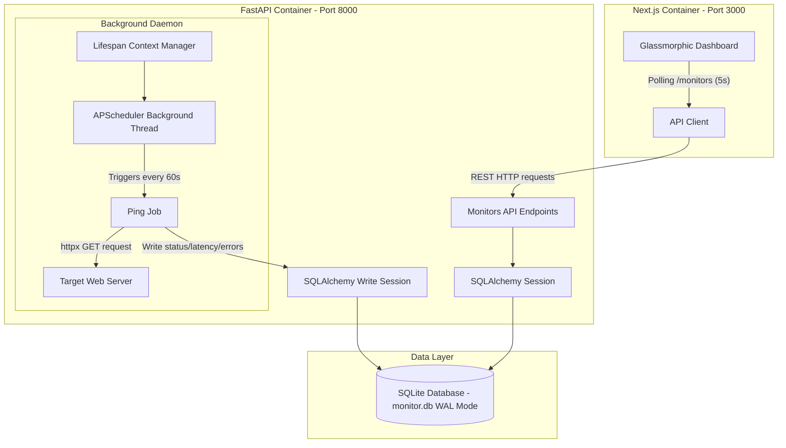
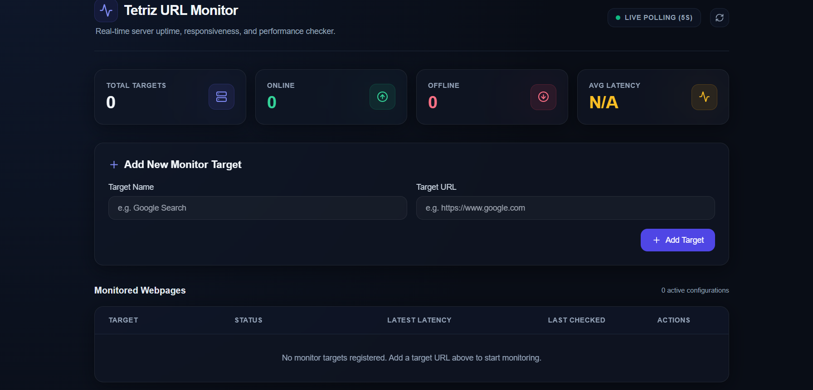
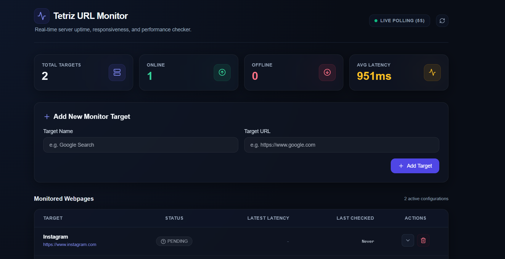
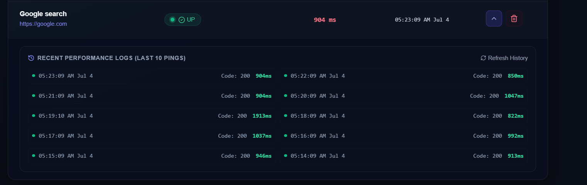
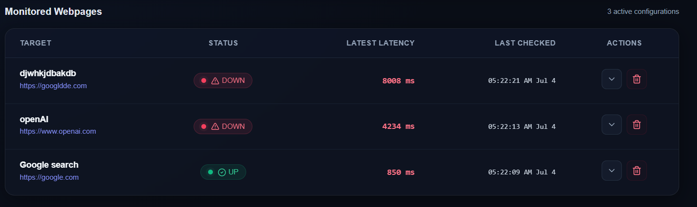
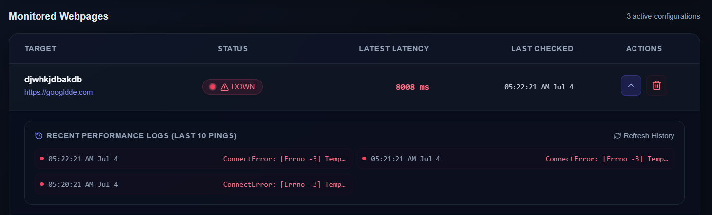

# 🖥️ URL Monitor

[](https://fastapi.tiangolo.com)
[](https://nextjs.org)
[](https://tailwindcss.com)
[](https://sqlite.org)
[](https://www.docker.com)
[](https://opensource.org/licenses/MIT)

A lightweight, production-quality, real-time URL uptime monitoring application. It registers target URLs, pings them every minute to capture HTTP status codes, latencies, and timestamps, and displays them on a high-fidelity glassmorphic dashboard that polls for updates in real time.

---

## ✨ Features

- **Instant Monitoring Setup**: Add and configure new HTTP/HTTPS targets directly from the UI.
- **Background Ping Engine**: Automated background check daemon pings active URLs every 60 seconds with configurable request timeouts.
- **Real-Time Performance Logs**: Keeps a persistent history of check metrics (latency, HTTP status, and transport errors).
- **Inline Diagnostics**: View the last 10 historical ping check statuses inline directly in the monitor list.
- **Optimistic UI Updates**: Instant updates on add and delete actions with automatic error rollback protection.
- **WAL-Enabled SQLite**: Enabled Write-Ahead Logging (WAL) mode for simultaneous write/read operations without database lock errors.

---

## 🛠️ Tech Stack

| Layer | Technology | Key Modules / Settings |
| :--- | :--- | :--- |
| **Backend API** | Python / FastAPI | SQLAlchemy v2 (ORM), Uvicorn (Web Server) |
| **Ping Scheduler** | APScheduler | `BackgroundScheduler` hooked directly into the FastAPI application lifespan |
| **Database** | SQLite | Persistent local storage, optimized with connection-level WAL mode |
| **Frontend UI** | Next.js 15 / React 19 | Tailwind CSS, TypeScript, Lucide React Icons |
| **Containerization**| Docker / Compose | Multi-stage slim Dockerfiles running under non-privileged system accounts |

---

## 📐 Architecture

The diagram below details the concurrent process flows within the unified application container:



---

## 🖼️ Screenshots

### Dashboard Home
The landing screen features a dark-themed glassmorphism layout, immediate status summary badges, and clean loading skeletons during initialization.


### Dashboard After Adding Monitors
Monitors list displays live status badges, latency indicators, and last-checked absolute time readouts.


### Monitoring History
Inline log expansion showing recent logs (up to the last 10 checks) with HTTP response status, error tracking, and response times.


### Multiple Active Monitors
Aggregated online/offline stats cards recalculating average latency across active targets.


### Failed URL Detection
Detailed failure reporting capturing connection timeouts, HTTP 5xx codes, and system exceptions under a dedicated offline badge.


---

## 🔌 API Endpoints

### Base URL: `http://localhost:8000`

| Method | Endpoint | Description | Request Body | Response Status |
| :--- | :--- | :--- | :--- | :--- |
| `POST` | `/monitors` | Register a new monitor URL | `{"url": "...", "name": "..."}` | `201 Created` |
| `GET` | `/monitors` | List all monitors + latest check status | *None* | `200 OK` |
| `DELETE` | `/monitors/{monitor_id}` | Unregister target (cascades checks) | *None* | `204 No Content` |
| `GET` | `/monitors/{monitor_id}/checks` | Get paginated ping check history | *Query parameters: limit, offset*| `200 OK` |
| `GET` | `/health` | Application status health probe | *None* | `200 OK` |

---

## 💻 Running Locally

### 1. Backend Server Setup
Ensure Python 3.11+ is installed.

```bash
# Navigate to backend folder
cd backend

# Initialize and activate virtual environment
python -m venv venv
source venv/bin/activate  # Windows Powershell: .\venv\Scripts\Activate.ps1

# Install package requirements
pip install -r requirements.txt

# Start the uvicorn development server
uvicorn app.main:app --reload --host 127.0.0.1 --port 8000
```
- Interactive Swagger docs: [http://127.0.0.1:8000/docs](http://127.0.0.1:8000/docs)

### 2. Frontend Development Server
Ensure Node.js 20+ is installed.

```bash
# Navigate to frontend folder
cd frontend

# Install node dependencies
npm install

# Run Next.js hot-reloaded dev server
npm run dev
```
- Dashboard URL: [http://localhost:3000](http://localhost:3000)

---

## 🐳 Docker

Start the entire stack using Docker Compose:

```bash
docker compose up --build
```

- **Frontend Container**: Exposes port `3000`. Runs Next.js optimized static build.
- **Backend Container**: Exposes port `8000`. Shares the SQLite data folder through a persistent Docker volume `db_data`.
- **Startup Sequence**: Next.js service boots only after the FastAPI healthcheck endpoint (`/health`) reports a `200 OK` status.

---

## 🧪 Testing

We leverage `pytest` along with `TestClient` for API route coverage and mock-assertions of HTTP ping behaviors:

```bash
# Activate virtual environment in backend folder and execute:
pytest tests/
```

Test categories covered:
- **Validators**: Invalid URL structures (missing schemes) and empty target names (HTTP 422).
- **Constraints**: Enforcing unique URL targets across the system (HTTP 409 Conflict).
- **CRUD Operations**: Listing, paginating history logs, and validating cascading deletes.
- **Ping Actions**: Simulating request successes (2xx), server failures (500), and request timeout exceptions.

---

## 📂 Project Structure

```text
/
├── backend/
│   ├── app/
│   │   ├── main.py            # FastAPI setup, Lifespan lifecycle events
│   │   ├── database.py        # SQLAlchemy SQLite setup & WAL session events
│   │   ├── models.py          # SQLAlchemy tables (Monitor & Check tables)
│   │   ├── schemas.py         # Pydantic validation structures
│   │   ├── crud.py            # SQLite queries using correlated subqueries
│   │   └── scheduler.py       # Periodic background check tasks
│   ├── tests/
│   │   ├── test_api.py        # API endpoint testing suite
│   │   └── test_scheduler.py  # Mocked scheduler checks suite
│   ├── Dockerfile             # Non-root secure runtime Docker file
│   └── requirements.txt
├── frontend/
│   ├── src/
│   │   ├── app/               # Layout & unified Dashboard page
│   │   ├── components/        # Form, Stats, Badge, and Table components
│   │   ├── hooks/             # useMonitors polling hook
│   │   └── lib/               # api.ts HTTP client helper
│   ├── Dockerfile             # Multi-stage optimized Docker file
│   ├── tailwind.config.ts
│   └── package.json
├── docker-compose.yml
├── README.md
└── AI_LOG.md
```

---

## 🔮 Future Improvements

1. **Extraction of Scheduler Worker**: Move the periodic ping daemon out of the API process and into a separate queue worker (e.g. Celery or ARQ) using Redis. This allows horizontal scaling of the API servers.
2. **Database Shifting**: Shift the connection configuration to PostgreSQL. SQLAlchemy model bindings are fully compatible, requiring only a change in `DATABASE_URL`.
3. **Data Retention Policy**: Implement a cleanup rule in the database to delete checks older than 30 days to keep database growth optimized.
4. **WebSocket/SSE Upgrades**: Convert the dashboard data-fetching from HTTP polling to WebSockets or Server-Sent Events (SSE) for lighter network overhead.

---

## 🤖 AI Collaboration

This repository was developed using pair-programming with the AI Coding Assistant. The structural decisions, architectural shifts, and collaboration notes are preserved in the [AI Collaboration Log](AI_LOG.md).
